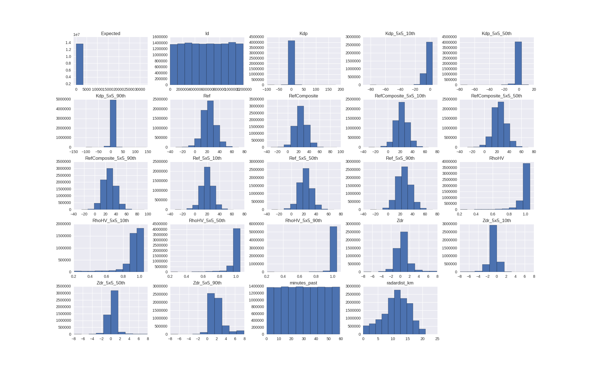

# Challenge Kaggle: How Much Did It Rain? II
  - Etudiant: Ghilas BELHADJ
  - Url: https://www.kaggle.com/c/how-much-did-it-rain-ii

## Aperçu des données
[Les données du challenge](https://www.kaggle.com/c/how-much-did-it-rain-ii/data) doivent se trouver dans le dossier `data`

```
data
   ├── test.csv
   └── train.csv
```

Les 10 premières lignes du fichier `train.csv`
```
Id,minutes_past,radardist_km,Ref,Ref_5x5_10th,Ref_5x5_50th,Ref_5x5_90th,RefComposite,RefComposite_5x5_10th,RefComposite_5x5_50th,RefComposite_5x5_90th,RhoHV,RhoHV_5x5_10th,RhoHV_5x5_50th,RhoHV_5x5_90th,Zdr,Zdr_5x5_10th,Zdr_5x5_50th,Zdr_5x5_90th,Kdp,Kdp_5x5_10th,Kdp_5x5_50th,Kdp_5x5_90th,Expected
1,3,10.0,,,,,,,,,,,,,,,,,,,,,0.25400013
1,16,10.0,,,,,,,,,,,,,,,,,,,,,0.25400013
1,25,10.0,,,,,,,,,,,,,,,,,,,,,0.25400013
1,35,10.0,,,,,,,,,,,,,,,,,,,,,0.25400013
1,45,10.0,,,,,,,,,,,,,,,,,,,,,0.25400013
1,55,10.0,,,,,,,,,,,,,,,,,,,,,0.25400013
2,1,2.0,9.0,5.0,7.5,10.5,15.0,10.5,16.5,23.5,0.99833333,0.99833333,0.99833333,0.99833333,0.375,-0.125,0.3125,0.875,1.0599976,-1.4100037,-0.3500061,1.0599976,1.0160005
2,6,2.0,26.5,22.5,25.5,31.5,26.5,26.5,28.5,32.0,116667,0.9816667,0.99833333,15,0.0625,-0.1875,0.25,0.6875,,,,1.4099884,1.0160005
2,11,2.0,21.5,15.5,20.5,25.0,26.5,23.5,25.0,27.0,116667,0.995,0.99833333,116667,0.3125,-0.0625,0.3125,0.625,0.34999084,,-0.3500061,1.7599945,1.0160005
```

## Description des attributs
On vas se reférer à la [description donnée sur Kaggle](https://www.kaggle.com/c/how-much-did-it-rain-ii/data) pour voir à quoi correspond chaque attribut.

  * Id: Un identifiant unique d'un ensemble d'observations sur une heure
  * minutes_past: La minute à laquelle l'observation a été faite ( relative a l'heure d'observation de chaque ensemble d'observations )
  * radardist_km: Dsitance de la jauge par rapport au radar qui prend la mesure sur cette gauge.
  * Ref: [Réflectivité](https://fr.wikipedia.org/wiki/R%C3%A9flectivit%C3%A9) en km ( c'est un rapport entre l'énergie réfléchie par rapport à l'énergie incidente d'un objet)
  * Ref_5x5_10th: 10émè [centile](https://fr.wikipedia.org/wiki/Centile) de reflexivité dans un voisinage 5x5 autour de la gauge.
  * Ref_5x5_50th: 50ème centile.
  * Ref_5x5_90th: 90ème centile.
  * RefComposite: Reflexivité maximum sur la colonne vertical au dessus de la gauge ( en [décibel Z](https://fr.wikipedia.org/wiki/D%C3%A9cibel_Z) )
  * RefComposite_5x5_10th: 10ème centile.
  * RefComposite_5x5_50th: 50ème centile.
  * RefComposite_5x5_90th: 90ème centile.
  * RhoHV: Un coeficient de correlation (sans unité)
  * RhoHV_5x5_10th: 10ème centile.
  * RhoHV_5x5_50th: 50ème centile.
  * RhoHV_5x5_90th: 90ème centile.
  * Zdr: Reflectivité différentiel en [Décibel](https://fr.wikipedia.org/wiki/D%C3%A9cibel)
  * Zdr_5x5_10th: 10ème centile.
  * Zdr_5x5_50th: 50ème centile.
  * Zdr_5x5_90th: 90ème centile.
  * Kdp: La phase différentielle spécifique (Utilisé pour localiser les régions à forte précipitations/Attenuations)
  * Kdp_5x5_10th: 10ème centile.
  * Kdp_5x5_50th: 50ème centile.
  * Kdp_5x5_90th: 90ème centile.
  * Expected: L'observation actuelle de la gauge en mm à la fin de l'heure

## Analyse des données
Colonne | max | min | std | mean
---|---|---|---|---
minutes_past |  59 | 0 | 17.30 | 29.52
radardist_km |  21 | 0 | 4.20 | 11.06
Ref |  71 | -31 | 10.35 | 22.92
Ref_5x5_10th |  62.5 | -32 | 9.20 | 19.95
Ref_5x5_50th |  69 | -32 | 10.05 | 22.61
Ref_5x5_90th |  72.5 | -28.5 | 11.10 | 25.89
RefComposite |  92.5 | -32 | 10.68 | 24.71
RefComposite_5x5_10th | 66 | -31 | 9.70 | 22.15
RefComposite_5x5_50th | 71 | -27.5 | 10.42 | 24.42
RefComposite_5x5_90th | 93.5 | -25 | 11.49 | 27.36
RhoHV | 1.05 | 0.2 | 0.09 | 0.97
RhoHV_5x5_10th | 1.05 | 0.2 | 0.12 | 0.91
RhoHV_5x5_50th | 1.05 | 0.2 | 0.07 | 0.97
RhoHV_5x5_90th | 1.05 | 0.2 | 0.04 | 1.01
Zdr |   7.93 | -7.87 | 1.51 | 0.53
Zdr_5x5_10th |   7.93 | -7.87 | 1.00 | -0.71
Zdr_5x5_50th |   7.93 | -7.87 | 0.93 | 0.33
Zdr_5x5_90th |   7.93 | -7.87 | 1.67 | 2.07
Kdp | 179 | -96.04 | 3.86 | 0.03
Kdp_5x5_10th |   3.51 | -80.79 | 2.79 | -3.48
Kdp_5x5_50th |  12.8 | -78.77 | 2.26 | -0.47
Kdp_5x5_90th | 144.6 | -100.2 | 4.14 | 4.07
Expected |   33017.73 | 0.01 | 548.60 | 108.62

Une fois que nous avont pris connaissance de chaque attribut et de sa plage de valeur, nous pouvons nettoyer les données des outlayers.

Les attributs dont le max et le min ne permettent pas de retrouver le mean, contienent surrement des outliers.

**Exemple:** *Expected* contient une valeur maximum de 33017.73 ... improbable. Les points qui ont des valeurs plus grande que 102mm/h sont probablement des outliers. (source: http://thewatchers.adorraeli.com/2015/07/15/record-rainfall-freak-storm-dumps-102-mm-of-rain-in-1-hour-norway/)



## Que faire des valeurs nulles
Certaines données ne sont pas disponible pour une raison ou pour une autre, il est ici question de décider si l'ont doit éliminer les lignes dans lesquelles elle se trouvent, ou bien les déduire afin d'utiliser un plus grand nombre de données.

Les valeurs suivantes représente le nombre de NaN sur chaque colonne:
```
colonne id, 0 NaN
colonne min, 0 NaN
colonne km, 0 NaN
colonne ref, 6533728 NaN
colonne ref10, 7573458 NaN
colonne ref50, 6524131 NaN
colonne ref90, 5368429 NaN
colonne refc, 6176380 NaN
colonne refc10, 7110407 NaN
colonne refc50, 6178189 NaN
colonne refc90, 5102588 NaN
colonne rho, 7928015 NaN
colonne rho10, 8709031 NaN
colonne rho50, 7924578 NaN
colonne rho90, 6986970 NaN
colonne zdr, 7928015 NaN
colonne zdr10, 8709031 NaN
colonne zdr50, 7924578 NaN
colonne zdr90, 6986970 NaN
colonne kdp, 8666078 NaN
colonne kdp10, 9404373 NaN
colonne kdp50, 8660920 NaN
colonne kdp90, 7815206 NaN
colonne exp, 0 NaN
```

Sur les 12 786 237 lignes du fichier ̀̀ train.csv` environs ~7 000 000 valeurs sont manquantes sur chaque colonne. Il s'agit d'un très grand nombre de lignes, et des stratégies doivent être utilisé pour combler ce manque d'information.

Si l'on enlève chaque ligne pour peu qu'elle contienne une valeur nulle, il nous restera 2 735 878 lignes pour l'apprentissage, contre 717 625 à prédir (test.csv).

De plus, on n'as pas le droit de retirer des lignes depuis le fichier `test.csv` car on doit soumettre impérativement 717 625 lignes sur Kaggle pour ce challenge, ce qui implique que l'ont doit remplir les NaN du fichier test.csv pour pouvoir faire de la prédiction.
